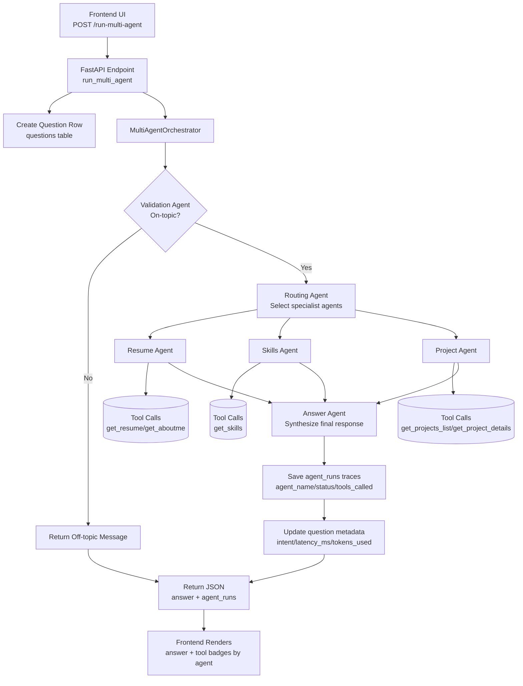

# Kate's AI Portfolio Assistant

A local prototype for a smart, conversational portfolio assistant built with ADK 2.0 (Agent Development Kit) and a FastAPI backend. The app now uses a multi-agent orchestration flow so prospective employers and collaborators can ask about Kate's (Ekaterina Tcareva) skills, professional experience, education, and AI/NLP projects with clearer routing and traceability.

---

## Architecture and Features

This project uses a multi-agent backend with a single-page frontend:
- Multi-agent orchestration: Each message sent to POST /run-multi-agent runs through validation, routing, specialist agents, and final synthesis.
- Specialist agents: Resume Agent, Skills Agent, and Project Agent use tools to fetch grounded information from local markdown files.
- Grounded answers (no hallucinations): Agents only answer from local knowledge files through tools.
- Persistent storage: Question records and per-agent run traces are stored in SQLite at database/portfolio.db.
- Trace metadata: Each question now stores intent, latency_ms, and tokens_used; each agent run stores agent name, status, output, and tools_called.
- Frontend transparency: Tool badges show which tool ran and which agent triggered it.

### Multi-Agent Flow Diagram



---

## Workspace Structure

```
ai-portfolio-assistant/
├── backend/
│   ├── app/
│   │   ├── multi_agent.py         # Agent definitions (validation, routing, specialist, answer)
│   │   ├── orchestration.py       # Multi-agent orchestration service
│   │   ├── fast_api_app.py        # FastAPI app and /run-multi-agent endpoint
│   │   ├── tools.py               # Local markdown reader tools
│   │   └── database.py            # SQLAlchemy models and DB bootstrap
│   ├── tests/                     # Unit and integration tests
│   └── pyproject.toml             # Backend dependencies
├── frontend/
│   ├── index.html
│   ├── app.js                     # Sends chat requests to /run-multi-agent
│   └── style.css
├── database/
│   └── portfolio.db               # SQLite DB (questions, agent_runs, feedback)
├── knowledge/
│   ├── resume.md
│   ├── skills.md
│   ├── aboutme.md
│   └── projects/
├── docs/
└── README.md
```

---

## Quick Start Guide

Follow these steps to run the portfolio assistant locally:

### Step 1: Start the Backend API Server
1. Navigate to the backend directory:

```bash
cd backend
```

2. Start the FastAPI development server with auto-reloading:

```bash
uv run uvicorn app.fast_api_app:app --host 0.0.0.0 --port 8000 --reload
```

The API server runs at http://localhost:8000.
API docs are available at http://localhost:8000/docs.

### Step 2: Open the Frontend Chat Interface
Run a simple static server for the frontend:

```bash
python3 -m http.server 8080 --directory frontend/
```

Then open http://localhost:8080 in your browser.

### Step 3: Optional API Smoke Test

```bash
curl -X POST http://localhost:8000/run-multi-agent \
   -H "Content-Type: application/json" \
   -d '{"session_id": "test", "message": "What AI projects has Kate done and what skills did she use?"}'
```

Expected response includes:
- status
- answer
- question_id
- agent_runs_count
- agent_runs (agent_name, status, tools_called)

---

## Suggested Questions to Try

When chatting with the assistant, you can ask questions like:
- What projects did Kate work on at LinkedIn?
- Tell me about her experience with RAG and LLM agents.
- What are Kate's core technical skills and programming languages?
- Summarize her work on Lamabot.
- Where did she complete her Georgia Tech master's degree?

## Data and Trace Storage

- Questions are stored in database/portfolio.db in table questions.
- Per-agent traces are stored in table agent_runs.
- Multi-agent runs populate question metadata fields intent, latency_ms, and tokens_used.
