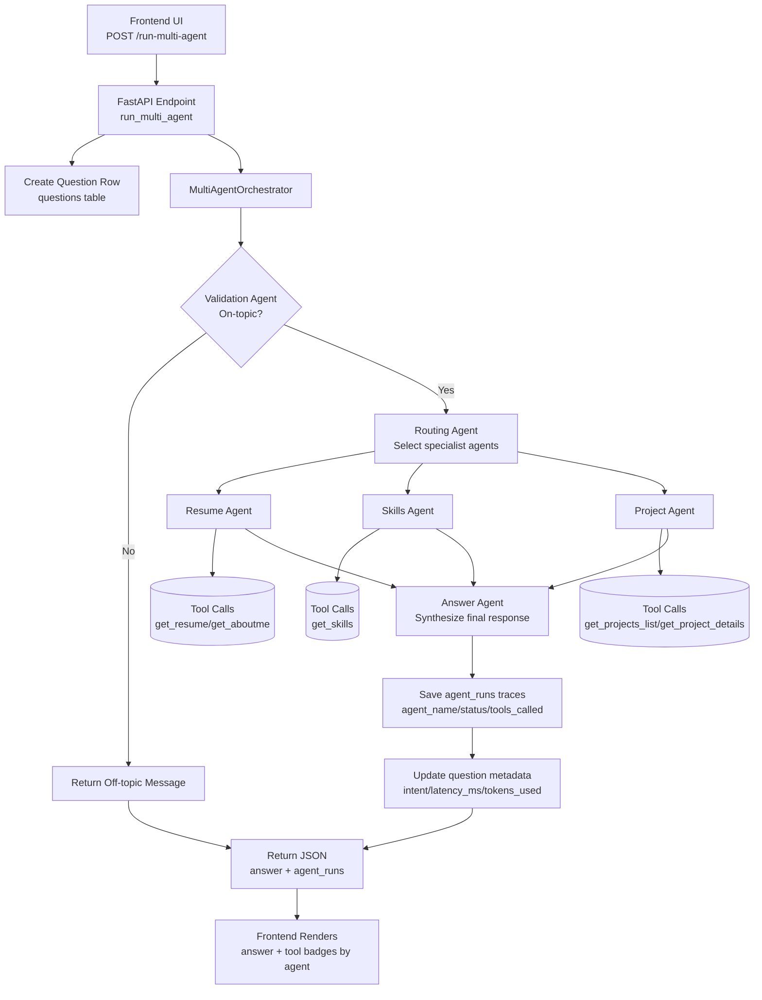

# Submission Write-Up: Kate's AI Portfolio Assistant

## Problem Statement
Prospective employers and collaborators often need a fast, reliable way to evaluate a candidate's real project experience, technical depth, and production impact. Traditional resumes are static and interviews are time-limited, so important context can be missed.

This agent addresses that real-world need by providing a grounded conversational interface that:
- Answers role-relevant questions about professional background, skills, and projects.
- Reduces hallucination risk by constraining responses to local knowledge sources.
- Produces traceable execution metadata for quality, latency, and safety monitoring.

The result is a practical portfolio evaluation assistant that improves signal quality for hiring and collaboration conversations.

## Solution Architecture
The implementation uses a frontend SPA, a FastAPI + ADK multi-agent backend, retrieval tools over local and vectorized knowledge, and persistent telemetry in database tables.

The architecture diagram below matches the README diagram.

Primary implementation references:
- [backend/app/fast_api_app.py](backend/app/fast_api_app.py)
- [backend/app/orchestration.py](backend/app/orchestration.py)
- [backend/app/multi_agent.py](backend/app/multi_agent.py)
- [backend/app/tools.py](backend/app/tools.py)
- [frontend/app.js](frontend/app.js)

## Concepts Used

### ADK Workflow
The solution follows an explicit multi-agent lifecycle: validate, route, specialize, synthesize, persist.
- Agent orchestration flow: [backend/app/orchestration.py](backend/app/orchestration.py)
- Endpoint integration and persistence updates: [backend/app/fast_api_app.py](backend/app/fast_api_app.py)

### LlmAgent
The project uses ADK Agent instances backed by Gemini models to implement role-specialized LLM behavior (validation, routing, resume, skills, project, synthesis).
- Agent definitions and instructions: [backend/app/multi_agent.py](backend/app/multi_agent.py)

### AgentTool
Specialists call retrieval tools to fetch grounded context before responding.
- Specialist tool wiring: [backend/app/multi_agent.py](backend/app/multi_agent.py)
- Tool implementation and retrieval/caching logic: [backend/app/tools.py](backend/app/tools.py)

### MCP Server
The tool interface is designed as an MCP-style capability boundary: model-side agents invoke explicit, typed tool functions instead of direct unrestricted data access. This separation supports governance, auditing, and substitution of retrieval backends.
- Tool surface and backend routing: [backend/app/tools.py](backend/app/tools.py)
- Agent-to-tool invocation flow: [backend/app/orchestration.py](backend/app/orchestration.py)

### Security Checkpoint
The validation stage acts as an early policy checkpoint before expensive multi-agent execution, and refusal handling is explicitly measured in evals.
- On-topic gate and refusal path: [backend/app/orchestration.py](backend/app/orchestration.py)
- Refusal eval scoring and thresholds: [backend/scripts/run_evals.py](backend/scripts/run_evals.py)
- Golden refusal test cases: [backend/tests/eval/datasets/eval_questions.json](backend/tests/eval/datasets/eval_questions.json)

### Agents CLI
Agents CLI is part of local development, eval, and deployment workflows.
- Command references and workflow: [backend/README.md](backend/README.md)

## Security Design

### Control 1: Domain Guardrail at Entry
What: Validation agent + deterministic on-topic checks reject non-domain questions.

Why it matters: For a portfolio assistant, this prevents misuse as a general assistant and reduces irrelevant or unsafe responses.

References:
- [backend/app/multi_agent.py](backend/app/multi_agent.py)
- [backend/app/orchestration.py](backend/app/orchestration.py)

### Control 2: Grounded Retrieval-Only Answers
What: Specialist agents are instructed to answer from retrieved context only and acknowledge missing information.

Why it matters: Prevents fabricated credentials, projects, or claims that would damage trust in hiring contexts.

References:
- [backend/app/multi_agent.py](backend/app/multi_agent.py)
- [backend/app/tools.py](backend/app/tools.py)

### Control 3: Restricted Tool Boundary
What: Data access is mediated through explicit tool functions and category filtering.

Why it matters: Limits blast radius and keeps retrieval auditable.

References:
- [backend/app/tools.py](backend/app/tools.py)
- [backend/app/orchestration.py](backend/app/orchestration.py)

### Control 4: Traceability and Forensics
What: Per-question and per-agent metadata are persisted (intent, latency, tokens, tools called, status).

Why it matters: Supports incident analysis, quality debugging, and compliance reporting.

References:
- [backend/app/database.py](backend/app/database.py)
- [backend/app/fast_api_app.py](backend/app/fast_api_app.py)

### Control 5: Continuous Evaluation with Refusal and Semantic Checks
What: Golden eval suite scores topic/project coverage, refusal correctness, and semantic quality; results persist to eval_results.

Why it matters: Detects regressions after prompt or knowledge updates before user-facing impact.

References:
- [backend/scripts/run_evals.py](backend/scripts/run_evals.py)
- [backend/tests/eval/datasets/eval_questions.json](backend/tests/eval/datasets/eval_questions.json)
- [backend/scripts/run_evals_after_changes.sh](backend/scripts/run_evals_after_changes.sh)

## MCP Server Design
This project exposes an MCP-style tool layer for controlled capabilities.

### Tool: retrieve_resume_context
Purpose: Fetches top relevant chunks from resume and about data for career/education questions.

### Tool: retrieve_skills_context
Purpose: Fetches top relevant chunks for technical skills and competency questions.

### Tool: retrieve_project_context
Purpose: Fetches top relevant chunks for project-focused questions.

### Core Tool: retrieve_context
Purpose: Shared retrieval engine with category filtering, backend abstraction (local/pgvector), and cache.

### Indexing/Sync Capability: index_pgvector_documents
Purpose: Builds and synchronizes vector index from knowledge sources at startup when enabled.

Implementation references:
- [backend/app/tools.py](backend/app/tools.py)
- [backend/app/multi_agent.py](backend/app/multi_agent.py)
- [backend/app/fast_api_app.py](backend/app/fast_api_app.py)

## HITL Flow
Human-in-the-loop controls are present at quality and product governance layers.

### Loop 1: End-user Response Feedback
- Users submit thumbs up/down per answer.
- Feedback is persisted and shown in admin metrics.
- Value: Captures real user quality signal beyond offline evals.

References:
- [frontend/app.js](frontend/app.js)
- [backend/app/fast_api_app.py](backend/app/fast_api_app.py)
- [backend/app/database.py](backend/app/database.py)

### Loop 2: Operator Review via Admin Dashboard
- Operators monitor top questions, intent/skill demand, latency, feedback rates, and recent failed/rejected questions.
- Value: Enables targeted prompt/tool/knowledge improvements.

References:
- [frontend/admin/index.html](frontend/admin/index.html)
- [frontend/admin/app.js](frontend/admin/app.js)
- [backend/app/fast_api_app.py](backend/app/fast_api_app.py)

### Loop 3: Engineering Regression Gate
- Engineers run golden evals after prompt/knowledge changes and inspect persisted eval_results.
- Value: Prevents silent quality and safety regressions.

References:
- [backend/scripts/run_evals.py](backend/scripts/run_evals.py)
- [backend/scripts/run_evals_after_changes.sh](backend/scripts/run_evals_after_changes.sh)
- [backend/app/database.py](backend/app/database.py)

## Demo Walkthrough
Use the same sample question style as README and run through three representative paths.

### Test Case 1: Project Path
Question: What projects did Kate work on at LinkedIn?

Expected behavior:
- Validation passes.
- Routing includes project-focused processing.
- Response references known project details grounded in knowledge sources.

### Test Case 2: Skills Path
Question: Tell me about her experience with RAG and LLM agents.

Expected behavior:
- Skills/context retrieval is used.
- Response covers RAG, LLM agents, and production relevance.
- Agent traces record latency and tool usage.

### Test Case 3: Cross-domain Summary Path
Question: What are Kate's core technical skills and programming languages?

Expected behavior:
- Skills specialist participates.
- Response is concise, role-relevant, and grounded.
- User can provide thumbs feedback; admins can later inspect aggregated metrics.

Sample references:
- [README.md](README.md)
- [frontend/app.js](frontend/app.js)
- [backend/app/fast_api_app.py](backend/app/fast_api_app.py)

## Impact and Value Statement

### For hiring teams
- Faster screening with high-signal, evidence-grounded Q and A.
- Better confidence through traceability and refusal discipline.

### For candidates and collaborators
- Richer presentation of real project impact than a static resume.
- Interactive exploration of skills, architecture choices, and outcomes.

### For platform owners
- Observable quality and latency trends via admin analytics.
- Repeatable regression detection via semantic + deterministic evals stored in database.

Net value: this system turns portfolio review into a measurable, governed conversational experience with practical safety and quality controls.
