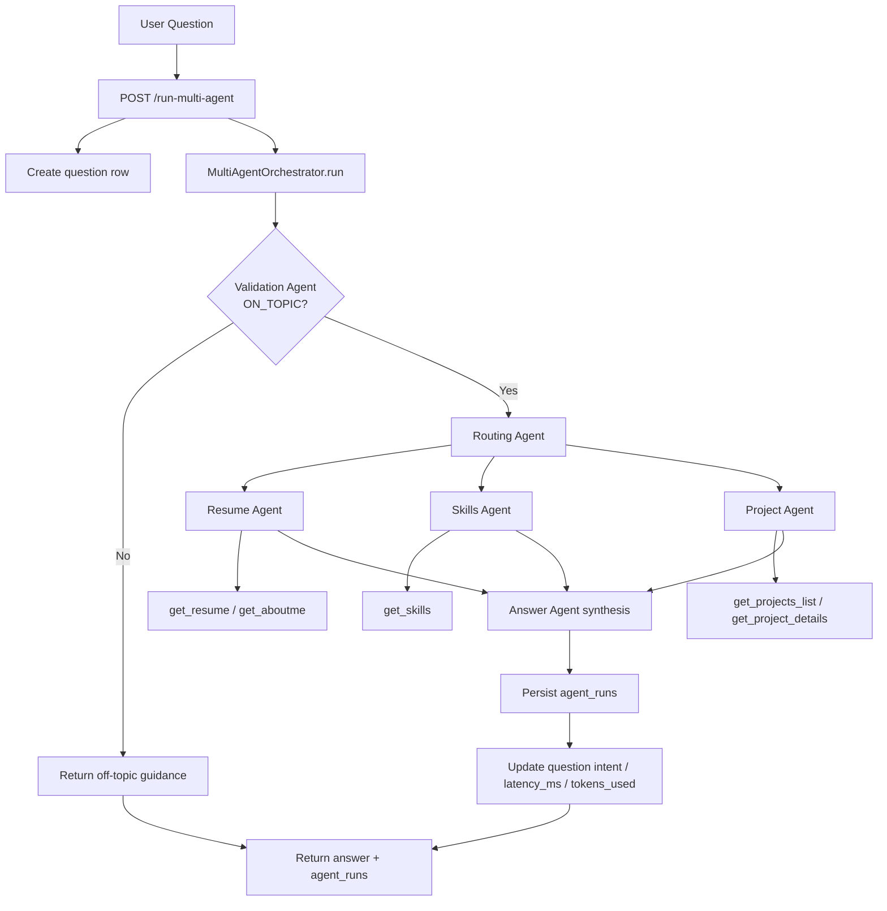
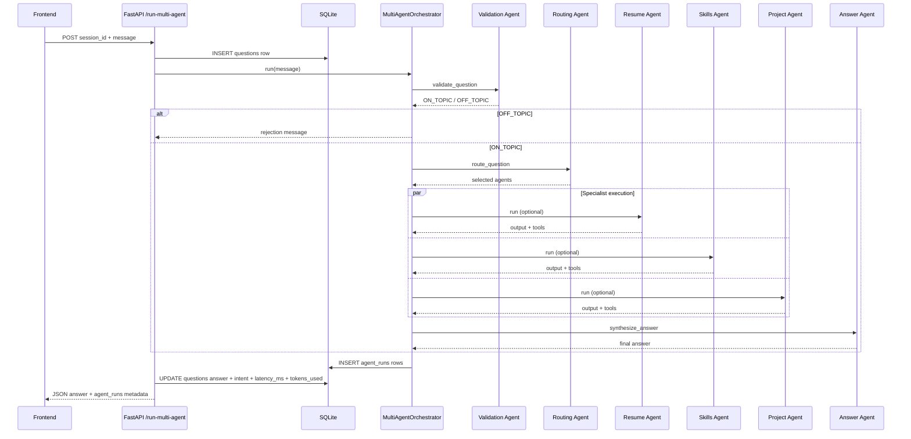

# Multi-Agent Architecture

## Overview

The portfolio assistant now uses a multi-agent orchestration system instead of a single monolithic agent. This provides better modularity, specialization, and debugging capabilities.

## Agent Flow

### Flowchart



### Sequence Diagram



## Agents

### 1. Validation Agent
- **Purpose**: Determines if user question is about Kate's professional profile
- **Model**: Gemini 3.5 Flash
- **Output**: `ON_TOPIC` or `OFF_TOPIC`
- **Tools**: None
- **Instruction**: Binary classification logic

### 2. Routing Agent
- **Purpose**: Analyzes question and routes to appropriate specialized agents
- **Model**: Gemini 3.5 Flash
- **Output**: JSON with list of agents to invoke
- **Tools**: None
- **Example Output**:
  ```json
  {
    "agents": ["resume_agent", "skills_agent", "project_agent"],
    "reasoning": "Question asks about Kate's experience and technical skills"
  }
  ```

### 3. Resume Agent
- **Purpose**: Answers questions about career history, education, certifications, publications
- **Model**: Gemini 3.5 Flash
- **Tools**: 
  - `get_resume()` - Full resume content
  - `get_aboutme()` - Career overview
- **Specialization**: Work experience, education, achievements

### 4. Skills Agent
- **Purpose**: Answers questions about technical skills, competencies, expertise areas
- **Model**: Gemini 3.5 Flash
- **Tools**:
  - `get_skills()` - Skills categorized by domain
- **Specialization**: Languages, frameworks, technologies, domains

### 5. Project Agent
- **Purpose**: Answers questions about specific projects Kate has worked on
- **Model**: Gemini 3.5 Flash
- **Tools**:
  - `get_projects_list()` - Lists all projects
  - `get_project_details(project_name)` - Details for specific project
- **Specialization**: Project goals, contributions, technologies, outcomes

### 6. Answer Agent
- **Purpose**: Synthesizes final response from specialized agent outputs
- **Model**: Gemini 3.5 Flash
- **Tools**: None
- **Specialization**: Coherence, professionalism, relevance

## Orchestration Workflow

The `MultiAgentOrchestrator` class in `orchestration.py` manages the workflow:

```python
def run(self, question: str) -> str:
    # Step 1: Validate question
    if not self.validate_question(question):
        return rejection_message
    
    # Step 2: Route to appropriate agents
    agents_to_run = self.route_question(question)
    
    # Step 3: Run specialized agents
    outputs = self.run_specialized_agents(question, agents_to_run)
    
    # Step 4: Synthesize final answer
    answer = self.synthesize_answer(question, outputs)
    
    # Step 5: Log all agent runs to database
    self.save_agent_runs(question_id)
    
    return answer
```

## Database Logging

Each agent run is logged to the `agent_runs` table:

| Column | Type | Purpose |
|--------|------|---------|
| `id` | Integer | Primary key |
| `question_id` | Foreign Key | Links to original question |
| `agent_name` | String | Name of agent (e.g., "resume_agent") |
| `start_time` | DateTime | When agent started |
| `end_time` | DateTime | When agent finished |
| `status` | String | "success" or "error" |
| `output` | Text | Agent response/output |
| `tools_called` | String | Comma-separated tool names |
| `tokens_used` | Integer | Token count (optional) |

### Example Log Entry

```
agent_name: "resume_agent"
start_time: 2026-06-23 14:32:15.123
end_time: 2026-06-23 14:32:18.456
status: "success"
output: "Kate has 5+ years of experience in ML and AI..."
tools_called: "get_resume"
tokens_used: 1200
```

## API Endpoint

### POST `/run-multi-agent`

**Request**:
```json
{
  "session_id": "sess_abc123",
  "message": "What are Kate's technical skills?"
}
```

**Response**:
```json
{
  "status": "success",
  "answer": "Kate has strong expertise in Python, ML, NLP...",
  "question_id": 42,
  "agent_runs_count": 6,
  "agent_runs": [
    {
      "agent_name": "skills_agent",
      "status": "success",
      "tools_called": "get_skills"
    }
  ]
}
```

**Flow**:
1. Get or create user session
2. Create `Question` record
3. Initialize `MultiAgentOrchestrator`
4. Run full orchestration workflow
5. Save agent runs to database
6. Update question record with answer
7. Return response

## Performance Characteristics

- **Validation**: ~500ms (single classifier)
- **Routing**: ~300ms (single router)
- **Specialized Agents**: ~1-2s each (3 agents max)
- **Answer Synthesis**: ~800ms (single synthesizer)
- **Total E2E**: ~4-6 seconds per question

## Error Handling

- **Agent failure**: Logged to `agent_runs` table with status="error"
- **Missing tools**: Falls back to concatenated outputs from other agents
- **Parsing errors**: Uses safe JSON parsing with fallback values
- **Network issues**: Logged and returned to user with error message

## Example Question Flow

**User**: "What projects has Kate worked on with machine learning?"

1. **Validation Agent**: 
   - Input: "What projects has Kate worked on with machine learning?"
   - Output: "ON_TOPIC"

2. **Routing Agent**:
   - Input: Same question
   - Output: `{"agents": ["project_agent", "skills_agent"]}`

3. **Project Agent**:
   - Input: Same question
   - Tools Called: `get_projects_list()`, `get_project_details("lamabot")`, etc.
   - Output: Detailed description of projects with ML components

4. **Skills Agent**:
   - Input: Same question
   - Tools Called: `get_skills()`
   - Output: ML/AI skills used in projects

5. **Answer Agent**:
   - Input: Outputs from Project and Skills agents
   - Output: "Kate has worked on the following ML projects..."

6. **Database Logging**:
   - 5 agent runs recorded with timestamps, status, and outputs

## Configuration

Each agent uses:
- **Model**: Gemini 3.5 Flash
- **Retry**: 3 attempts with exponential backoff
- **Timeout**: Default ADK timeout
- **Temperature**: Default (0.7)

## Benefits Over Single-Agent

| Aspect | Single Agent | Multi-Agent |
|--------|-------------|------------|
| Modularity | Monolithic | Specialized |
| Debugging | Difficult | Easy - see each agent's output |
| Specialization | General | Domain-specific |
| Scaling | Hard | Each agent can be optimized |
| Testing | Complex | Test each agent independently |
| Transparency | Black box | Clear routing + reasoning |
| Performance | Fixed | Optimizable per agent |

## Future Enhancements

- **Parallel execution**: Run specialized agents concurrently
- **Caching**: Cache tool outputs across questions
- **Agent quality metrics**: Track accuracy per agent
- **Dynamic routing**: Learn routing patterns from feedback
- **Tool optimization**: Add more specialized tools per agent
- **Follow-ups**: Remember previous questions in session

## Testing

Multi-agent setup can be tested using:

```bash
# Run all tests
uv run pytest tests/

# Test orchestration specifically
uv run pytest tests/integration/test_multi_agent.py

# Test individual agents
uv run pytest tests/unit/test_validation_agent.py
```

## Related Files

- [orchestration.py](orchestration.py) - MultiAgentOrchestrator implementation
- [multi_agent.py](multi_agent.py) - Agent definitions
- [database.py](database.py) - Agent runs schema
- [fast_api_app.py](fast_api_app.py) - `/run-multi-agent` endpoint
